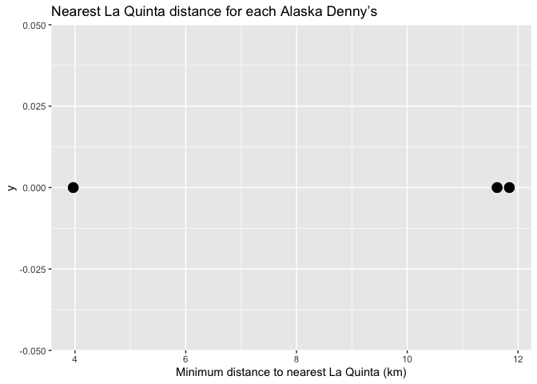
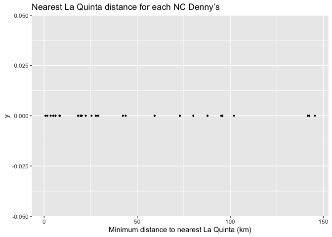
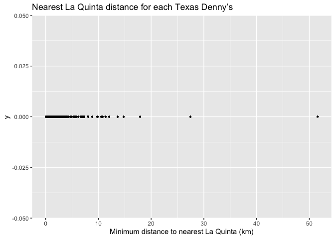

Lab 05 - La Quinta is Spanish for next to Denny’s, Pt. 2
================
George Nesbitt
02/13/2026

### Load packages and data

``` r
library(tidyverse) 
library(dsbox) 
```

``` r
states <- read_csv("data/states.csv")
```

### Exercise 1

``` r
dn_ak <- dennys %>%
  filter(state == "AK")
nrow(dn_ak)
```

    ## [1] 3

``` r
lq_ak <- laquinta %>%
  filter(state == "AK")
nrow(lq_ak)
```

    ## [1] 2

There are three Denny’s in Alaska and two LaQuintas

### Exercise 2

We need to calculate six distances because there are three Denny’s and
two LaQuintas (3\*2)=6

### Exercise 3

``` r
dn_lq_ak <- full_join(dn_ak, lq_ak,
  by = "state"
)
```

    ## Warning in full_join(dn_ak, lq_ak, by = "state"): Detected an unexpected many-to-many relationship between `x` and `y`.
    ## ℹ Row 1 of `x` matches multiple rows in `y`.
    ## ℹ Row 1 of `y` matches multiple rows in `x`.
    ## ℹ If a many-to-many relationship is expected, set `relationship =
    ##   "many-to-many"` to silence this warning.

``` r
dn_lq_ak
```

    ## # A tibble: 6 × 11
    ##   address.x     city.x state zip.x longitude.x latitude.x address.y city.y zip.y
    ##   <chr>         <chr>  <chr> <chr>       <dbl>      <dbl> <chr>     <chr>  <chr>
    ## 1 2900 Denali   Ancho… AK    99503       -150.       61.2 3501 Min… "\nAn… 99503
    ## 2 2900 Denali   Ancho… AK    99503       -150.       61.2 4920 Dal… "\nFa… 99709
    ## 3 3850 Debarr … Ancho… AK    99508       -150.       61.2 3501 Min… "\nAn… 99503
    ## 4 3850 Debarr … Ancho… AK    99508       -150.       61.2 4920 Dal… "\nFa… 99709
    ## 5 1929 Airport… Fairb… AK    99701       -148.       64.8 3501 Min… "\nAn… 99503
    ## 6 1929 Airport… Fairb… AK    99701       -148.       64.8 4920 Dal… "\nFa… 99709
    ## # ℹ 2 more variables: longitude.y <dbl>, latitude.y <dbl>

### Exercise 4

``` r
glimpse(dn_lq_ak)
```

    ## Rows: 6
    ## Columns: 11
    ## $ address.x   <chr> "2900 Denali", "2900 Denali", "3850 Debarr Road", "3850 De…
    ## $ city.x      <chr> "Anchorage", "Anchorage", "Anchorage", "Anchorage", "Fairb…
    ## $ state       <chr> "AK", "AK", "AK", "AK", "AK", "AK"
    ## $ zip.x       <chr> "99503", "99503", "99508", "99508", "99701", "99701"
    ## $ longitude.x <dbl> -149.8767, -149.8767, -149.8090, -149.8090, -147.7600, -14…
    ## $ latitude.x  <dbl> 61.1953, 61.1953, 61.2097, 61.2097, 64.8366, 64.8366
    ## $ address.y   <chr> "3501 Minnesota Dr.", "4920 Dale Rd", "3501 Minnesota Dr."…
    ## $ city.y      <chr> "\nAnchorage", "\nFairbanks", "\nAnchorage", "\nFairbanks"…
    ## $ zip.y       <chr> "99503", "99709", "99503", "99709", "99503", "99709"
    ## $ longitude.y <dbl> -149.9119, -147.8660, -149.9119, -147.8660, -149.9119, -14…
    ## $ latitude.y  <dbl> 61.18843, 64.82426, 61.18843, 64.82426, 61.18843, 64.82426

There are 6 observations and 11 variables. They are: address, city,
state (denny’s only), zip, longitude, latitude. All variables except for
state are listed for both dennys and laquinta/ .

### Exercise 5

We use the function mutate() to add a new variable to a data frame while
keeping the existing variables. …

``` r
haversine <- function(long1, lat1, long2, lat2, round = 3) {
  # convert to radians
  long1 <- long1 * pi / 180
  lat1 <- lat1 * pi / 180
  long2 <- long2 * pi / 180
  lat2 <- lat2 * pi / 180

  R <- 6371 # Earth mean radius in km

  a <- sin((lat2 - lat1) / 2)^2 + cos(lat1) * cos(lat2) * sin((long2 - long1) / 2)^2
  d <- R * 2 * asin(sqrt(a))

  return(round(d, round)) # distance in km
}
```

### Exercise 6

``` r
dn_lq_ak <- dn_lq_ak %>%
  mutate(distance = haversine(latitude.y, longitude.y, latitude.x, longitude.x, round=3))
```

### Excercise 7

``` r
dn_lq_ak <- dn_lq_ak %>%
  group_by(latitude.x, longitude.x) %>%
  mutate(min_distance = min(distance, na.rm = TRUE)) %>%
  ungroup()
```

### Excercise 8

``` r
dn_lq_ak %>%
  summarise(
    n_dennys = n(),
    mean = mean(min_distance, na.rm = TRUE),
    sd = sd(min_distance, na.rm = TRUE),
    median = median(min_distance, na.rm = TRUE),
    iqr = IQR(min_distance, na.rm = TRUE),
    min = min(min_distance, na.rm = TRUE),
    max = max(min_distance, na.rm = TRUE)
  )
```

    ## # A tibble: 1 × 7
    ##   n_dennys  mean    sd median   iqr   min   max
    ##      <int> <dbl> <dbl>  <dbl> <dbl> <dbl> <dbl>
    ## 1        6  9.15  4.01   11.6  5.91  3.97  11.8

``` r
ggplot(dn_lq_ak %>% group_by(min_distance),
       aes(x = min_distance, y = 0)) +
  geom_point(size = 4) +
  labs(
    title = "Nearest La Quinta distance for each Alaska Denny’s",
    x = "Minimum distance to nearest La Quinta (km)")
```

<!-- --> There are
three Denny’s which I have graphed above on a single planed line showing
the minimum distance each location is to the nearest La Quinta. The mean
distance is 9.145333 and the SD is 4.010.

### Excercise 9

``` r
lq_nc <- laquinta %>%
  filter(state == "NC")
nrow(lq_nc)
```

    ## [1] 12

``` r
dn_nc <- dennys %>%
  filter(state == "NC")
nrow(dn_nc)
```

    ## [1] 28

``` r
dn_lq_nc <- full_join(dn_nc, lq_nc,
  by = "state"
)
```

    ## Warning in full_join(dn_nc, lq_nc, by = "state"): Detected an unexpected many-to-many relationship between `x` and `y`.
    ## ℹ Row 1 of `x` matches multiple rows in `y`.
    ## ℹ Row 1 of `y` matches multiple rows in `x`.
    ## ℹ If a many-to-many relationship is expected, set `relationship =
    ##   "many-to-many"` to silence this warning.

``` r
dn_lq_nc
```

    ## # A tibble: 336 × 11
    ##    address.x    city.x state zip.x longitude.x latitude.x address.y city.y zip.y
    ##    <chr>        <chr>  <chr> <chr>       <dbl>      <dbl> <chr>     <chr>  <chr>
    ##  1 1 Regent Pa… Ashev… NC    28806       -82.6       35.6 165 Hwy … "\nBo… 28607
    ##  2 1 Regent Pa… Ashev… NC    28806       -82.6       35.6 3127 Slo… "\nCh… 28208
    ##  3 1 Regent Pa… Ashev… NC    28806       -82.6       35.6 4900 Sou… "\nCh… 28217
    ##  4 1 Regent Pa… Ashev… NC    28806       -82.6       35.6 4414 Dur… "\nDu… 27707
    ##  5 1 Regent Pa… Ashev… NC    28806       -82.6       35.6 1910 Wes… "\nDu… 27713
    ##  6 1 Regent Pa… Ashev… NC    28806       -82.6       35.6 1201 Lan… "\nGr… 27407
    ##  7 1 Regent Pa… Ashev… NC    28806       -82.6       35.6 1607 Fai… "\nCo… 28613
    ##  8 1 Regent Pa… Ashev… NC    28806       -82.6       35.6 191 Cres… "\nCa… 27518
    ##  9 1 Regent Pa… Ashev… NC    28806       -82.6       35.6 2211 Sum… "\nRa… 27612
    ## 10 1 Regent Pa… Ashev… NC    28806       -82.6       35.6 1001 Aer… "\nMo… 27560
    ## # ℹ 326 more rows
    ## # ℹ 2 more variables: longitude.y <dbl>, latitude.y <dbl>

``` r
dn_lq_nc <- dn_lq_nc %>%
  mutate(distance = haversine(latitude.y, longitude.y, latitude.x, longitude.x, round=3))
```

``` r
dn_lq_nc <- dn_lq_nc %>%
  group_by(latitude.x, longitude.x) %>%
  mutate(min_distance = min(distance, na.rm = TRUE)) %>%
  ungroup()
```

``` r
dn_lq_nc %>%
  summarise(
    n_dennys = n(),
    mean = mean(min_distance, na.rm = TRUE),
    sd = sd(min_distance, na.rm = TRUE),
    median = median(min_distance, na.rm = TRUE),
    iqr = IQR(min_distance, na.rm = TRUE),
    min = min(min_distance, na.rm = TRUE),
    max = max(min_distance, na.rm = TRUE)
  )
```

    ## # A tibble: 1 × 7
    ##   n_dennys  mean    sd median   iqr   min   max
    ##      <int> <dbl> <dbl>  <dbl> <dbl> <dbl> <dbl>
    ## 1      336  48.3  45.1   28.1  66.3 0.626  145.

``` r
ggplot(dn_lq_nc %>% group_by(min_distance),
       aes(x = min_distance, y = 0)) +
  geom_point(size = .5) +
  labs(
    title = "Nearest La Quinta distance for each NC Denny’s",
    x = "Minimum distance to nearest La Quinta (km)")
```

<!-- --> Above you
can see the distribution of all 336 (lol wsnc zip area code) locations
of denny’s and their proximity to the closest laquintas. There is a
pretty spread out distribution, especially from 0 to 100 kms. Unlike
Alaska, there are denny’s way far away from any LaQuintas. The mean of
the data is 48.33393 km and the SD is 45.07359 km.

### Excercise 9

``` r
lq_tx <- laquinta %>%
  filter(state == "TX")
nrow(lq_tx)
```

    ## [1] 237

``` r
dn_tx <- dennys %>%
  filter(state == "TX")
nrow(dn_tx)
```

    ## [1] 200

``` r
dn_lq_tx <- full_join(dn_tx, lq_tx,
  by = "state"
)
```

    ## Warning in full_join(dn_tx, lq_tx, by = "state"): Detected an unexpected many-to-many relationship between `x` and `y`.
    ## ℹ Row 1 of `x` matches multiple rows in `y`.
    ## ℹ Row 1 of `y` matches multiple rows in `x`.
    ## ℹ If a many-to-many relationship is expected, set `relationship =
    ##   "many-to-many"` to silence this warning.

``` r
dn_lq_tx
```

    ## # A tibble: 47,400 × 11
    ##    address.x    city.x state zip.x longitude.x latitude.x address.y city.y zip.y
    ##    <chr>        <chr>  <chr> <chr>       <dbl>      <dbl> <chr>     <chr>  <chr>
    ##  1 120 East I-… Abile… TX    79601       -99.6       32.4 3018 Cat… "\nAb… 79606
    ##  2 120 East I-… Abile… TX    79601       -99.6       32.4 3501 Wes… "\nAb… 79601
    ##  3 120 East I-… Abile… TX    79601       -99.6       32.4 14925 La… "\nAd… 75254
    ##  4 120 East I-… Abile… TX    79601       -99.6       32.4 909 East… "\nAl… 78516
    ##  5 120 East I-… Abile… TX    79601       -99.6       32.4 2400 Eas… "\nAl… 78332
    ##  6 120 East I-… Abile… TX    79601       -99.6       32.4 1220 Nor… "\nAl… 75013
    ##  7 120 East I-… Abile… TX    79601       -99.6       32.4 1165 Hwy… "\nAl… 76009
    ##  8 120 East I-… Abile… TX    79601       -99.6       32.4 880 Sout… "\nAl… 77511
    ##  9 120 East I-… Abile… TX    79601       -99.6       32.4 1708 Int… "\nAm… 79103
    ## 10 120 East I-… Abile… TX    79601       -99.6       32.4 9305 Eas… "\nAm… 79118
    ## # ℹ 47,390 more rows
    ## # ℹ 2 more variables: longitude.y <dbl>, latitude.y <dbl>

``` r
dn_lq_tx <- dn_lq_tx %>%
  mutate(distance = haversine(latitude.y, longitude.y, latitude.x, longitude.x, round=3))
```

``` r
dn_lq_tx <- dn_lq_tx %>%
  group_by(latitude.x, longitude.x) %>%
  mutate(min_distance = min(distance, na.rm = TRUE)) %>%
  ungroup()
```

``` r
dn_lq_tx %>%
  summarise(
    n_dennys = n(),
    mean = mean(min_distance, na.rm = TRUE),
    sd = sd(min_distance, na.rm = TRUE),
    median = median(min_distance, na.rm = TRUE),
    iqr = IQR(min_distance, na.rm = TRUE),
    min = min(min_distance, na.rm = TRUE),
    max = max(min_distance, na.rm = TRUE)
  )
```

    ## # A tibble: 1 × 7
    ##   n_dennys  mean    sd median   iqr   min   max
    ##      <int> <dbl> <dbl>  <dbl> <dbl> <dbl> <dbl>
    ## 1    47400  2.74  4.84   1.49  2.47 0.005  51.6

``` r
ggplot(dn_lq_tx %>% group_by(min_distance),
       aes(x = min_distance, y = 0)) +
  geom_point(size = .5) +
  labs(
    title = "Nearest La Quinta distance for each Texas Denny’s",
    x = "Minimum distance to nearest La Quinta (km)")
```

<!-- --> The Texas
one proves the Hedberg joke much more than the NC one and provides a
greater range of data than the AK one. There are a vast majority of
Denny’s with distances within 20 km of a La Quinta. There is one clear
outlier past the 50 km mark. The mean is 2.73755 and the SD is 4.843115.

### Excercise 11

``` r
lq_or <- laquinta %>%
  filter(state == "OR")
nrow(lq_or)
```

    ## [1] 10

``` r
dn_or <- dennys %>%
  filter(state == "OR")
nrow(dn_or)
```

    ## [1] 24

``` r
dn_lq_or <- full_join(dn_or, lq_or,
  by = "state"
)
```

    ## Warning in full_join(dn_or, lq_or, by = "state"): Detected an unexpected many-to-many relationship between `x` and `y`.
    ## ℹ Row 1 of `x` matches multiple rows in `y`.
    ## ℹ Row 1 of `y` matches multiple rows in `x`.
    ## ℹ If a many-to-many relationship is expected, set `relationship =
    ##   "many-to-many"` to silence this warning.

``` r
dn_lq_or
```

    ## # A tibble: 240 × 11
    ##    address.x    city.x state zip.x longitude.x latitude.x address.y city.y zip.y
    ##    <chr>        <chr>  <chr> <chr>       <dbl>      <dbl> <chr>     <chr>  <chr>
    ##  1 3435 Se Spi… Albany OR    97321       -123.       44.6 61200 So… "\nBe… 97702
    ##  2 3435 Se Spi… Albany OR    97321       -123.       44.6 1777 LaR… "\nCe… 97502
    ##  3 3435 Se Spi… Albany OR    97321       -123.       44.6 155 Day … "\nEu… 97401
    ##  4 3435 Se Spi… Albany OR    97321       -123.       44.6 243 Nort… "\nGr… 97526
    ##  5 3435 Se Spi… Albany OR    97321       -123.       44.6 45 South… "\nNe… 97365
    ##  6 3435 Se Spi… Albany OR    97321       -123.       44.6 11207 No… "\nPo… 97220
    ##  7 3435 Se Spi… Albany OR    97321       -123.       44.6 4319 NW … "\nPo… 97210
    ##  8 3435 Se Spi… Albany OR    97321       -123.       44.6 890 Hawt… "\nSa… 97301
    ##  9 3435 Se Spi… Albany OR    97321       -123.       44.6 8815 Sou… "\nWi… 97070
    ## 10 3435 Se Spi… Albany OR    97321       -123.       44.6 120 Arne… "\nWo… 97071
    ## # ℹ 230 more rows
    ## # ℹ 2 more variables: longitude.y <dbl>, latitude.y <dbl>

``` r
dn_lq_or <- dn_lq_or %>%
  mutate(distance = haversine(latitude.y, longitude.y, latitude.x, longitude.x, round=3))
```

``` r
dn_lq_or <- dn_lq_or %>%
  group_by(latitude.x, longitude.x) %>%
  mutate(min_distance = min(distance, na.rm = TRUE)) %>%
  ungroup()
```

``` r
dn_lq_or %>%
  summarise(
    n_dennys = n(),
    mean = mean(min_distance, na.rm = TRUE),
    sd = sd(min_distance, na.rm = TRUE),
    median = median(min_distance, na.rm = TRUE),
    iqr = IQR(min_distance, na.rm = TRUE),
    min = min(min_distance, na.rm = TRUE),
    max = max(min_distance, na.rm = TRUE)
  )
```

    ## # A tibble: 1 × 7
    ##   n_dennys  mean    sd median   iqr   min   max
    ##      <int> <dbl> <dbl>  <dbl> <dbl> <dbl> <dbl>
    ## 1      240  76.6  131.   9.32  62.2 0.115  486.

``` r
ggplot(dn_lq_or %>% group_by(min_distance),
       aes(x = min_distance, y = 0)) +
  geom_point(size = .5) +
  labs(
    title = "Nearest La Quinta distance for each Oregon Denny’s",
    x = "Minimum distance to nearest La Quinta (km)")
```

<!-- --> In this
distribution, there is a large distribution of data points arranged
between 0 and 50 km however there are 5 data points that are within the
100-500km range with one even ranging all the way to what looks like
480km distance.

The mean is 76.60392 and the SD is 130.8993.

### Excercise 12

To me, I think from the data that I have seen, the correlation between
Denny’s locations and LQ locations does not seem to be significant. I
think that while there are certainly plenty, probably even the majority,
of Denny’s locations that are within 5kms of a LaQuinta, I think you
could probably say the exact same thing about mcdonalds and motel 6 or
any other crappy hotel/fast food restaraunt chain. There does not seem
to be any credible statistical evidence that this is unique nor
significant.

### Excercise 13
